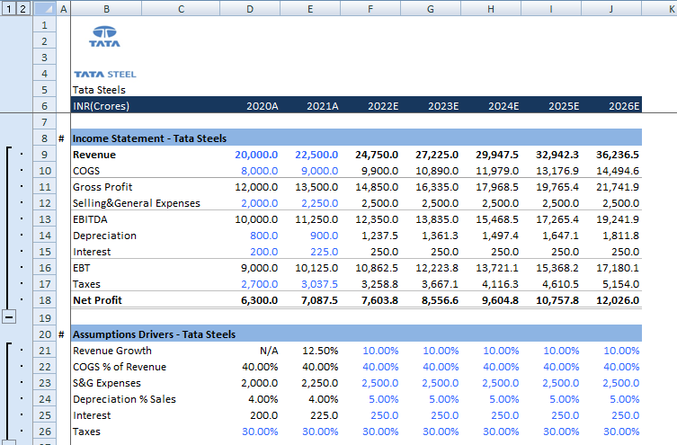

# Financial Model — Tata Steel Ltd.

A from-scratch financial model built in Microsoft Excel analyzing Tata Steel's 
financials using assumptions-driven modeling techniques.

## What This Model Covers

**Income Statement Model**
- Revenue, COGS, EBITDA, Depreciation, Interest, EBT, Tax, and Net Profit
- Assumptions-driven projections using growth rates and margin percentages
- Any input change in the assumptions block flows through the entire model automatically

**Common Size Analysis**
- Every line item expressed as a percentage of revenue
- Allows quick comparison of cost structure across periods

**Change Analysis Statement**
- Models the impact of a changed revenue growth assumption across all line items

**Costing & Expense Breakdown**
- Weighted average, median, min, max, and SMALL/LARGE analysis across cost categories

**Finance Math & Time Functions**
- Monthly and annual period calculations
- Stub year vs full year handling
- IF-based error checks to validate model integrity

## Tools Used
- Microsoft Excel (Advanced)
- Formulas: IF, AVERAGE, MEDIAN, MIN, MAX, SMALL, LARGE, weighted average logic
- Color-coded inputs and outputs

## Key Skills Demonstrated
- Assumptions-driven financial modeling
- P&L construction and projection
- Common size statement preparation
- Financial error-checking using IF conditions
- Time period and stub year handling

## About
Built as part of self-directed financial modeling practice to develop FP&A 
skills including forecasting, cost analysis, and structured financial 
statement construction.

---
